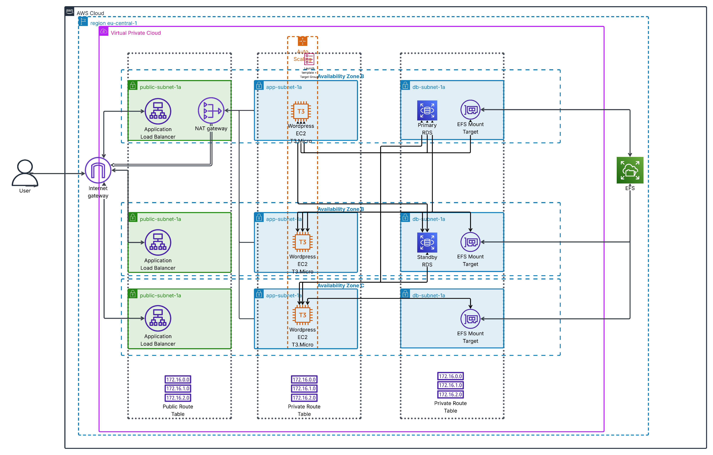

# 3-Tier WordPress on AWS: Scalable, Secure & Fully IaC

**`tierapp` – production-grade, 3-tier WordPress architecture on AWS**, built **100% with Terraform**.

This project demonstrates **real-world DevOps & Cloud Engineering**:
- High availability across 3 AZs
- Auto-scaling with shared EFS storage
- Security isolation via Security Groups
- Cost optimization (single NAT, Free Tier eligible)

---

## System Architecture




---

## Key Features

| Feature | Implementation |
|-------|----------------|
| **3-Tier Architecture** | Web (ALB) → App (ASG) → DB (RDS + EFS) |
| **High Availability** | 3 AZs, Multi-AZ-ready VPC |
| **Auto Scaling** | Min: 1, Desired: 3, Max: 5 EC2 (`t3.micro`) |
| **Shared Storage** | EFS mounted on all app instances (`wp-content`) |
| **Secure by Default** | Isolated security groups |
| **Zero-Downtime Deploy** | Launch Template + User Data automation |

---

## Estimated Costs (AWS Free Tier)

| Resource | Cost |
|--------|------|
| **EC2 (3x t3.micro)** | Free (750h) |
| **RDS (db.t4g.micro)** | Free (750h) |
| **EFS** | Free (5 GB) |
| **ALB** | Free (750h + 25 GB) |
| **NAT Gateway** | ~**$32/month** *(main cost)* |

> **Total (Free Tier)**: **~$32/month** (mainly NAT)

---

## Detailed Breakdown

### 1. **VPC & Networking**
- CIDR: `10.0.0.0/16`
- 3 AZs: `eu-central-1a/b/c`
- Subnets:
  - Public: `10.0.21–23.0/24`
  - Private: `10.0.11–13.0/24`
  - Database: `10.0.31–33.0/24`
- **Single NAT Gateway**

### 2. **Web Tier: ALB**
- Listener: `HTTP:80`
- Security Group (`web-sg`): `80`, `443` from `0.0.0.0/0`

### 3. **App Tier: ASG**
- Launch Template:
  - AMI: `ami-099981549d4358e9a`
  - `t3.micro`, `DemoKeyPair`
  - Security Group (`app-sg`): `80` from `web-sg`
- **User Data** (`userdata.sh`):
  - Installs WordPress
  - Connects to RDS
  - Mounts EFS to `/wp-content`

### 4. **Database: RDS MySQL**
- `db.t4g.micro`, 60 GB
- `admin` / `adminadmin`
- Security Group (`db-sg`): `3306` from `app-sg`

### 5. **Storage: EFS**
- Mount targets in each private subnet
- Security Group (`efs-sg`): `2049` from `app-sg`

---

## Security Groups

| SG | Allows | From |
|----|--------|------|
| `web-sg` | 80, 443 | `0.0.0.0/0` |
| `app-sg` | 80 | `web-sg` |
| `db-sg` | 3306 | `app-sg` |
| `efs-sg` | 2049 | `app-sg` |

---

## How to Deploy

```bash
git clone https://github.com/ItmanBuildsClouds/3-tier-app
cd 3-tier-app


terraform init
terraform plan
terraform apply

  
## Note on AWS Free Tier
This project is designed to operate within the AWS Free Tier, ensuring zero costs for low-traffic workloads. For accounts created after July 15, 2025, the Free Plan limits the account to 6 months. To fully utilize the 12-month Free Tier for API Gateway, upgrade to a Paid Plan before the 6-month period ends. Details: [AWS Free Tier](https://aws.amazon.com/free/).
## Diagram
The architecture diagram (`./assets/diagram.png`) was created using AWS Architecture Icons under the Creative Commons Attribution 4.0 International License (CC BY 4.0). Source: [AWS Architecture Icons](https://aws.amazon.com/architecture/icons/). The diagram was built with Lucidchart.


